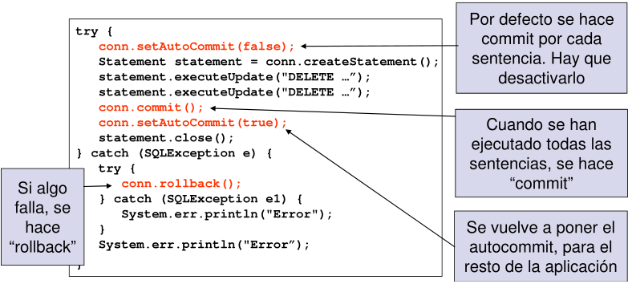

# MySQL

## Ejemplos

>**Nota:** para realizar los ejemplos se ha utilizado la base de datos: **[tubalcain](sql/tubalcain.sql)**.

### Conexión

1. [ConnMySQL](EJ_01_ConnMySQL.java) -Clase que se conecta con una base de datos y realiza una consulta.
2. [DataBaseMetaData](EJ_02_DatabaseMetaData.java) -Clase que muestra información de la base de datos.
3. [ResultSetMetaData](EJ_03_ResultSetMetaData.java) -Clase que muestra información de una sentencia.

### Métodos del objeto Statement

- **executeQuery(String):** Recuperar datos de un único objeto ResulSet. Principalmente bajo la sentencia SELECT
- **executeUpdate(String):** Se utiliza para sentencias INSERT, UPDATE, DELETE, CREATE, DROP, ALTER. Devuelve el número de filas afectadas y para las sentencias DDL devuelve 0.
- **execute(String):** Se pude usar para cualquier sentencia. Devuelve true si devuelve un ResulSet (getResultSet) y false si devuelve un recuento de filas (getUpdateCount)

4. [Execute](EJ_04_Execute.java) -Clase que realiza un Select, utilizando el método **execute()**.
5. [ExecuteUpdate](EJ_05_ExecuteUpdate.java) -Clase que realiza una insercción de datos utilizando el método **executeUpdate()**.
6. [Vista](EJ_06_CrearVista.java) -Clase que realiza la creación de una **vista**.
7. [Sentencia Preparada](EJ_07_SentenciaPreparada.java) -Clase que realiza una insercción de datos mediante el uso de una **sentencia preparada**.

### Declaración de llamadas a procedimientos y funciones

	- {call nombre_procedimiento}: sin parámetros
	- { ? = call nombre_funcion}: devuelve un valor
	- {call nombre_procedimiento(?,?,...)}: recibe parámetros
	- {? = nombre_funcion(?,?,...)}: devuelve un valor (primer parámetro) y recibe varios parámetros

8. [Procedimiento_subida_sal](EJ_08_Procedimiento_subida_sal.java) -Clase que hace una llamada al procedimiento subida_sal

```sql
CREATE PROCEDURE subida_sal(d INT, subida INT)
BEGIN
UPDATE empleados SET salario = salario + subida WHERE dpto_no = d;
COMMIT;
END;
```

9. [Funcion_nombre_dept](EJ_09_Funcion_nombre_dept.java) -Clase que hace una llamada a la función nombre_dep

```sql
CREATE FUNCTION nombre_dep(d INT) RETURNS VARCHAR(15)
BEGIN
	DECLARE nombre VARCHAR(15);
	SET nombre = 'NO EXISTE';
	SELECT dnombre INTO nombre FROM departamentos
	WHERE dpto_no = d;
	RETURN NOMBRE;
END;
```

10. [Procedimiento_datos_dept](EJ_10_Procedimiento_datos_dept.java) -Clase que hace una llamada al procedimiento datos_dep

```sql
CREATE PROCEDURE datos_dep(d INT, OUT nombre VARCHAR(15), OUT localidad VARCHAR(15))
BEGIN
	SET nombre = 'NO EXISTE';
	SET localidad = 'NO EXISTE';
	SELECT dnombre, loc INTO nombre, localidad FROM departamentos
	WHERE dpto_no = d;
END;
```

### Transacciones

[Canal makigas](https://www.youtube.com/channel/UCQufRmIMRTLdRxTsXCh4-5w) 
- [Transacciones, commits y rollbacks (parte 1)](https://www.youtube.com/watch?v=oDo8Kr9YqE8)
- [Transacciones, commits y rollbacks (parte 2)](https://www.youtube.com/watch?v=v4EBceRzDUE)




## ACTIVIDAD

1. Crea un DB en db4free con las sentencias que aparecen en el fichero [jorgedam](sql/jorgedam.sql)

2. Crea una clase para el acceso a la base de datos con los siguientes métodos. Controlar errores y utilizar sentencias preparadas:
	- Conectar a la base de datos (carga del driver y establecimiento de conexión).
	- Insertar un departamento. El método recibirá tres argumentos (número, nombre y localidad).
	- El mismo que el anterior pero recibiendo un solo argumento, un objeto de la clase departamento. Será necesario por 		tanto crear una clase departamento, con sus atributos y métodos getter y setter.
	- Método que devuelva un ArrayList de objetos departamento ante la consulta de todas las columnas de todos los 	departamentos de la tabla dept
	- Método que reciba un número de departamento y devuelva sus datos mediante un objeto.
	- Método que reciba un objeto departamento y actualice la tabla dept.
	- Método que reciba un número de departamento y lo dé de baja.
	- Ídem del anterior pero devolviendo el número de filas afectadas.
	- Método que reciba un número de departamento y actualice su localidad (segundo argumento del método). Utilizar el siguiente procedimiento:
	
	```sql
	CREATE PROCEDURE actualizaDept(cod INT(2), localidad VARCHAR(13))
	BEGIN
		UPDATE DEPT SET LOC=localidad WHERE DEPTNO = cod;
	END;
	```
**Solución:** [AD_CrearBD_y_Metodos](AD_CrearBD_y_Metodos.java) 
